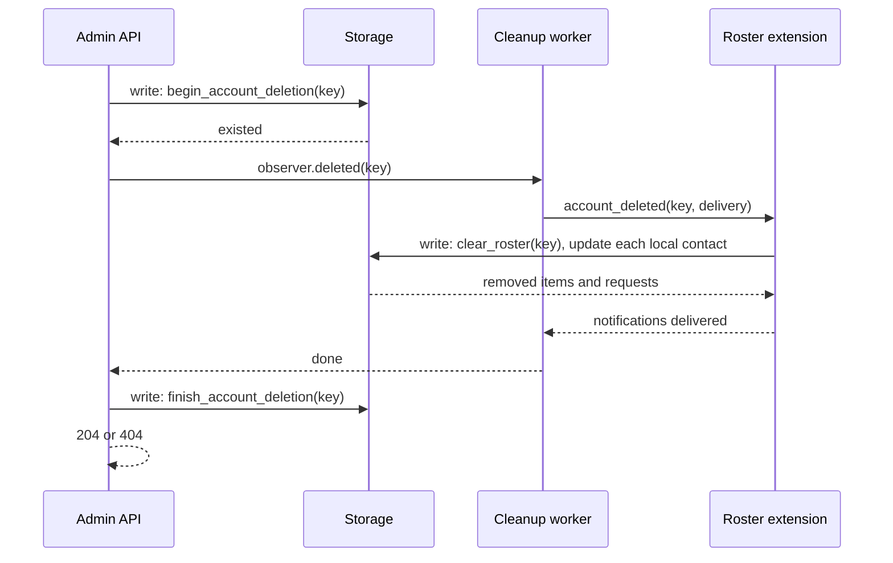
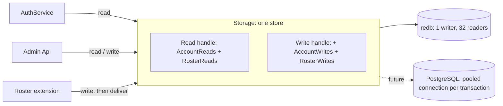

# Storage transactions

- **Status:** Draft
- **Authors:** Miguel Ángel Ortuño

## TL;DR

Every storage operation moves onto a transaction handle obtained from a `Storage` trait, with one handle type for reads and one for writes, each implemented by the backend. The roster's subscription state machine leaves the redb module and is rebuilt in the extension from a small set of primitive operations whose contracts hold at commit time on any backend. Account deletion becomes a durable three-step protocol with a tombstone, which removes the in-memory lifecycle lock, the existence reads under the sequencer, and the rescan loop introduced in #97. The work is three pull requests and precedes roster versioning.

## Goal

Lonewolf must gain a storage interface that a second backend, PostgreSQL, can implement without duplicating business logic, and that lets callers compose several storage operations into one atomic unit. Today each repository method is one hidden transaction, cross-table logic lives inside the redb module, and consistency between the account and roster tables is enforced by conventions in the extension. The desired outcome is one transaction domain per store, atomic multi-operation writes available to every caller, invariants that the backend enforces at commit, and account deletion that survives a crash.

## Background

### Current shape

`lonewolf-storage` exposes two traits, `AccountRepository` and `RosterRepository`, each implemented by a redb type that wraps a shared `RedbDatabase`. `RedbDatabase` owns one redb `Database` and two blocking executors: 32 threads for reads and 1 thread for writes. Every repository method clones its arguments, submits a closure to one executor, and the closure opens its own redb transaction, does the work, and commits. redb permits one write transaction at a time and any number of read transactions, and its transactions cannot cross an `await`.

The core builds the redb types from configuration (`crates/lonewolf-core/src/storage.rs`) and hands them to three consumers: authentication (`AuthService`) reads SCRAM verifiers; the admin service creates, lists, deletes accounts and changes passwords; the roster extension owns roster items, versions, and pending subscription requests. The roster always uses the store selected for accounts.

### What is wrong with it

- **Business logic lives in storage.** `request_subscription`, `cancel_subscription`, `unsubscribe`, `remove_item`, and `resolve_pending` in `crates/lonewolf-storage/src/roster/redb.rs` implement the RFC 6121 subscription state machine so that both rosters and the pending table change in one transaction. A PostgreSQL backend would have to implement the same state machine again.
- **Cross-store consistency is a convention.** The roster decides whether an account exists by reading the account table, then writes roster rows in a separate transaction. #97 closed the resulting races by requiring every flow to take its ordering guard before the read and by making cleanup rescan until empty. Each new write path must remember the convention.
- **Deletion is not durable.** The admin service deletes the record, then asks extensions to clean up while holding an in-memory lock. A crash between the two leaves roster state that a recreated account would inherit. Nothing resumes an unfinished deletion after a restart.
- **No composition.** A caller cannot perform two repository operations atomically, so every atomic combination becomes a new repository method with a large signature and a bespoke outcome type.

### Reference

Jackal (`pkg/storage/repository`) hands the same repository interface to a callback as a `Transaction`, and offers a storage-level `Locker`. The transaction idea transfers; the locker does not, because Lonewolf runs one process per database and redb's write transaction is already exclusive. PostgreSQL row locks cover the same need there.

## Requirements

### Functional

- A caller must be able to run several storage operations in one atomic transaction and receive a result computed inside it.
- Read-only operations must be available on a read handle that cannot write.
- Every write that depends on an account's existence must fail at commit if the account is absent, on every backend, without the caller reading the account first.
- Account deletion must remove the record and block recreation in one atomic step, run extension cleanup afterwards, and allow recreation only once cleanup has finished.
- An unfinished deletion must be completed after a restart.
- The roster extension must implement the subscription state machine itself, using primitive storage operations.
- All existing integration scenarios under `crates/lonewolf-core/tests/protocol/` must pass unchanged in client-visible behavior.

### Non-functional

- No C or C++ dependencies (AGENTS.md section 9). redb stays; a PostgreSQL backend must use a pure Rust driver.
- No schema migration or version check (AGENTS.md section 12). New tables are initialized by current code; existing records are not rewritten.
- Disk I/O must not run on core runtime threads. redb page reads and `fsync` on commit stay on the blocking executors.
- A write transaction must hold storage work only. Awaiting anything else inside one stalls every other write on redb.
- Transactions are per store. Operations on two stores cannot share a transaction; the configuration keeps the roster on the account store.
- The per-operation cost on redb rises from one thread handoff per flow to one per operation plus one for commit. Flows have at most about eight operations; a handoff costs microseconds and a durable commit costs milliseconds, so the commit dominates as before.

## Proposal

### Storage trait and handles

```rust
pub trait Storage: Send + Sync + 'static {
    type Read<'a>: ReadTransaction + Send + 'a where Self: 'a;
    type Write<'a>: WriteTransaction + Send + 'a where Self: 'a;

    /// Runs `work` in one read transaction.
    fn read<'s, T: Send + 's>(
        &'s self,
        work: impl for<'t> FnOnce(&'t Self::Read<'s>) -> BoxFuture<'t, Result<T, StorageError>> + Send + 's,
    ) -> impl Future<Output = Result<T, StorageError>> + Send + 's;

    /// Runs `work` in one write transaction, commits on `Ok`, and aborts on `Err` or drop.
    fn write<'s, T: Send + 's>(
        &'s self,
        work: impl for<'t> FnOnce(&'t mut Self::Write<'s>) -> BoxFuture<'t, Result<T, StorageError>> + Send + 's,
    ) -> impl Future<Output = Result<T, StorageError>> + Send + 's;
}

pub trait ReadTransaction: AccountReads + RosterReads {}
pub trait WriteTransaction: ReadTransaction + AccountWrites + RosterWrites {}
```

The closure returns a boxed `Send` future. One allocation per transaction is accepted because stable Rust cannot bound the future of an `AsyncFnOnce` as `Send`, and because a transaction already performs disk or network I/O.

The repository operations are grouped in one read trait and one write trait per repository. A new repository adds one pair of traits and extends the two bounds above. Consumers are generic over `S: Storage`: `Roster<S>`, the admin `Api<S>`, and `AuthService<S>`. The core instantiates `RedbStorage`.

Operations return `impl Future<Output = Result<_, _>> + Send`, as today. A backend maps its own errors to `StorageError` and to the repository errors (`AccountError`, `RosterError`).

### redb implementation

`RedbStorage` keeps the `Database`, the two executors, and one async lock that admits write transactions.

- `write` acquires the async lock, then opens the redb write transaction on the writer thread. The lock, not redb, serializes writers, so the writer thread never blocks inside `begin_write` while another handle is open. It releases the lock after commit or abort.
- `RedbWrite` owns the `WriteTransaction`. Each operation moves the transaction to the writer thread with a closure, runs there, and moves it back with the result. Commit runs the same way and carries the `fsync`.
- `RedbRead` owns a `ReadTransaction` and runs each operation on the read executor. Read transactions are not admitted by a lock; redb supports many at once.
- Dropping a handle without commit aborts the transaction.
- `RedbStorage::in_memory()` builds on redb's `InMemoryBackend` for tests.

### Repository operations

Read side:

| Trait | Operation | Returns |
|---|---|---|
| `AccountReads` | `account(key)` | `Option<Account>` |
| `AccountReads` | `account_state(key)` | `Active`, `Deleting`, or `Absent` |
| `AccountReads` | `scram(key, hash)` | `Option<ScramVerifier>` |
| `AccountReads` | `accounts_after(after, limit)` | one page of accounts in key order |
| `AccountReads` | `unfinished_deletions()` | keys with a tombstone |
| `RosterReads` | `roster(owner)` | `RosterSnapshot` |
| `RosterReads` | `roster_item(owner, jid)` | `Option<RosterItem>` |
| `RosterReads` | `pending_requests(owner)` | `Vec<PendingSubscription>` |
| `RosterReads` | `pending_request(owner, sender)` | `Option<PendingSubscription>` |

Write side:

| Trait | Operation | Contract at commit |
|---|---|---|
| `AccountWrites` | `create_account(account)` | `AlreadyExists` if the record exists; `Deleting` if a tombstone exists |
| `AccountWrites` | `replace_credentials(key, credentials)` | `NotFound` if the record is absent |
| `AccountWrites` | `begin_account_deletion(key)` | removes the record and writes the tombstone; returns whether the record existed; a second call with a tombstone present returns `false` |
| `AccountWrites` | `finish_account_deletion(key)` | removes the tombstone |
| `RosterWrites` | `put_roster_item(owner, item)` | writes the item, advances the owner's version, returns it; `NoAccount` if the owner has no record |
| `RosterWrites` | `remove_roster_item(owner, jid)` | removes the item and advances the version; `None` if absent |
| `RosterWrites` | `put_pending_request(owner, request)` | replaces any request from the same sender; `NoAccount` if the owner has no record |
| `RosterWrites` | `remove_pending_request(owner, sender)` | returns whether a request existed |
| `RosterWrites` | `clear_roster(owner)` | removes items, requests and version; returns the removed items and requests |

The `NoAccount` contract is the mechanism that replaces the existence reads from #97. On redb the write checks the account table inside the exclusive transaction. On PostgreSQL a foreign key from the roster tables to the account table produces the same failure, because the tombstone lives in a separate table and the account row is gone once deletion has begun. The caller handles `NoAccount` per operation and never reads the account table to guard a write.

Operations that leave storage: `update_subscription`, `request_subscription`, `cancel_subscription`, `unsubscribe`, `remove`, `remove_item`, `resolve_pending`, `delete_all`, and their outcome types `SubscriptionRequestOutcome`, `SubscriptionCancellation`, `SubscriptionWithdrawal`, `ItemRemoval`, and `PendingResolution`. `RosterItem`, `RosterItemUpdate`, `RosterSubscription`, `RosterVersion`, `RosterSnapshot`, `RosterMutation`, `PendingSubscription`, and `RosterJid` stay.

### Roster extension

Each flow becomes one write transaction that reads what it needs, applies the state machine, writes with the primitives, and returns what to deliver. Deliveries run after the transaction returns. The sequencer stays around the transaction and the deliveries so pushes reach clients in the order storage applied them; it no longer guards any storage decision. A subscription request, abbreviated:

```rust
let outcome = self
    .storage
    .write(|tx| {
        Box::pin(async move {
            let granted = tx.roster_item(&contact, &requester_jid).await?
                .is_some_and(|item| item.subscription.grants());
            if granted {
                return approve_outbound(tx, &requester, &contact_jid).await;
            }
            match tx.put_pending_request(&contact, request).await {
                Err(RosterError::NoAccount) => return Ok(Outcome::ContactMissing),
                result => result?,
            }
            let mut item = tx.roster_item(&requester, &contact_jid).await?.unwrap_or_else(|| RosterItem::bare(contact_jid));
            if item.subscription.pending_out || item.subscription.subscribed_to() {
                return Ok(Outcome::Pending { push: None });
            }
            item.subscription.pending_out = true;
            let version = tx.put_roster_item(&requester, item.clone()).await?;
            Ok(Outcome::Pending { push: Some(RosterMutation { version, value: item }) })
        })
    })
    .await?;
```

The `Forbidden` answer for a session whose account is gone follows from `NoAccount` on the requester's own write. `ContactMissing` maps to `service-unavailable` as today.

### Account deletion



- Step 1 is atomic. From this point `create_account` answers `Deleting` and every roster write for the account fails with `NoAccount`, so no operation that started before the deletion can add state afterwards. The admin maps `Deleting` to `409 account_deleting`.
- Step 2 runs each extension's `account_deleted` hook unchanged in signature. The roster hook runs one write transaction that clears the account's roster and pending requests, clears each local contact's subscription to the account, and returns the removals. Deliveries follow the commit. The hook is idempotent: a second run finds nothing and delivers nothing.
- Step 3 removes the tombstone. A tombstone left behind by a crash is found by `unfinished_deletions()` at startup, and the server runs steps 2 and 3 for each key before accepting client connections.
- The admin keeps the detached lifecycle task from #97 so a connection deadline does not leave a tombstone behind in normal operation, but the per-account lifecycle lock is removed. Concurrent deletions of the same key are harmless: the second `begin_account_deletion` returns `false`, and the second cleanup finds nothing.
- Notifications lost to a crash between steps 2 and 3 are not replayed. Contacts' rosters were updated in step 2, so a roster fetch shows the final state.

### Changes by area

**`lonewolf-storage`**

- Add `Storage`, `ReadTransaction`, `WriteTransaction`, and the four repository traits. Remove `AccountRepository` and `RosterRepository`.
- Add `RedbStorage`, `RedbRead`, `RedbWrite`, and a tombstone table `lonewolf_account_deletions`.
- Add `AccountError::Deleting` and `RosterError::NoAccount`.
- Add a backend contract test suite, generic over `S: Storage`, that redb runs today and PostgreSQL will run later. Flow tests for the subscription state machine move to the extension.

**`lonewolf-extension`**

- `Roster<S: Storage>` replaces `Roster<R, C>`. The subscription state machine moves into `roster/subscription.rs`, built on the primitives. `lock_parties`, `lock_with_contact`, `require_account`, and `account_exists` are removed. `forget_account` becomes one transaction plus deliveries.

**`lonewolf-admin`**

- `Api<S: Storage>` replaces `Api<R>`. Deletion follows the three-step protocol. Listing pages through `accounts_after`. The lifecycle lock shards are removed.

**`lonewolf-core`**

- `StoreRegistry` yields `RedbStorage` per configured store. `AuthService<S>` reads verifiers through a read transaction. Startup completes unfinished deletions before listeners start. `account_cleanup` is unchanged except for the worker's storage type.

**Configuration**

- No key changes. `backend = "redb"` already exists. The reference gains one sentence stating that a store is one transaction domain and that the roster uses the account store.

### Data flow



### Delivery plan

| PR | Content | Risk |
|---|---|---|
| 1 | `Storage` trait, redb handles, contract tests. Existing coarse operations are kept as methods on the write handle so the extension and admin compile with minimal change. | Low: mechanical, no behavior change |
| 2 | Primitives replace the coarse operations. The state machine moves into the extension with its tests. | Medium: the flows are rewritten; integration scenarios are the safety net |
| 3 | Tombstone, three-step deletion, startup resume, removal of the lifecycle lock and rescan loop. | Low: replaces existing mechanisms one for one |

Roster versioning (#94 item 4) starts after PR 3 so its write path lands on the primitives.

## Alternatives considered

- **Enforce cross-table invariants inside the redb module.** Rejected: every invariant and every flow would be reimplemented per backend, and business logic would stay in storage.
- **A storage-level `Locker` as in Jackal.** Rejected: on one node the write transaction is the lock, and PostgreSQL row locks cover the multi-connection case. Cross-node delivery ordering is a routing concern.
- **One concrete transaction type shared by all backends.** Rejected: redb and PostgreSQL transactions have different ownership and thread constraints; an associated type per backend is required.
- **Async closures (`AsyncFnOnce`) instead of a boxed future.** Rejected for now: the returned future cannot be bounded as `Send` on stable Rust. Revisit when `async_fn_traits` stabilizes.
- **Run redb operations inline on the runtime thread.** Rejected: page cache misses and commit `fsync` would block a core worker.
- **Pass the transaction handle into `Extension::account_deleted`.** Rejected: it makes `Extension` generic over the storage type and breaks its `dyn` use. The tombstone gives the same isolation with the hook unchanged.
- **Keep per-call repository methods and add flows per backend.** Rejected: duplicated state machine.

## Open questions

- PostgreSQL driver and its integration with the compio runtime. Deferred to the PostgreSQL backend PR; the trait does not expose runtime types.
- Whether roster versioning needs a per-item version column. Deferred to that item; `put_roster_item` already returns the new version.
- Whether startup should block on unfinished deletions or run them alongside listener start. Proposal: block, since deletions are rare and cleanup is a few transactions.
